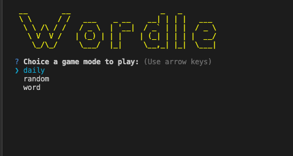
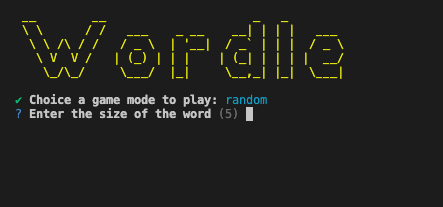
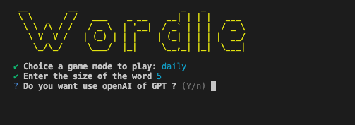
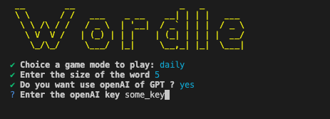
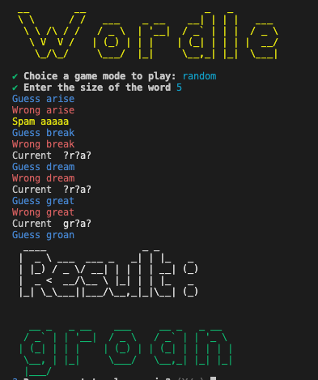

## I. Run Project

1. Clone the repository:
  ```sh
  git clone /Users/mr.xep/Desktop/my-project/wordle
  ```

2. Navigate to the project directory:
  ```sh
  cd wordle
  ```

3. Install the dependencies:
  ```sh
  yarn install
  ```

4. Start the game:
  ```sh
  node index.js
  ```

5. Choose the mode to play:



6. Input length of word



7. Choose have using GPT to play.


8. If using GPT to play Enter openAI key


9. The Programming will auto play the game.



## II. Document

### Querying the Datamuse API

To query a word using the Datamuse API, you can use the following endpoint:

```sh
https://api.datamuse.com/words?sp=he??o
```

### Example Response

The response from the Datamuse API for the query `https://api.datamuse.com/words?sp=he??o` might look like this:

```json
[
  {
    "word": "hello",
    "score": 4231
  },
  {
    "word": "hero",
    "score": 3000
  }
]
```

For more information on the Datamuse API, visit [Datamuse API Documentation](https://www.datamuse.com/api/).
